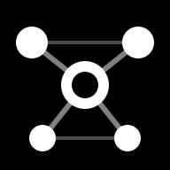

<div align="center">



# Clustr

**Transform text into interactive knowledge graphs**

Reveal patterns, clusters, gaps, and trends with AI-powered analysis.

[Live Demo](https://clustr.run) · [Report Bug](https://github.com/user/clustr/issues)

</div>

---

## ✨ Features

### 📊 Visualization
- **2D & 3D Force Graphs** — Interactive visualization with zoom, drag, and node selection
- **Topic Maps** — AI-extracted high-level concepts and their relationships
- **Sentiment Colors** — Toggle sentiment overlay (positive/neutral/negative)
- **Cluster Detection** — Automatic community detection using Louvain algorithm

### 🧠 AI Analysis
- **Smart Summaries** — AI-generated overviews of your content
- **Research Questions** — Discover unexplored angles
- **Pattern Insights** — Find hidden connections
- **Chat Interface** — Ask questions about your graph

### 📥 Import
- **Text** — Paste or type directly
- **Files** — PDF, DOCX, XLSX, Markdown, CSV, images (OCR)
- **URLs** — Web pages, YouTube transcripts, RSS feeds
- **Folders** — Import entire directory structures

### 📤 Export
- JSON, SVG, PNG, CSV (keywords & analytics), GEXF

---

## 🚀 Getting Started

```bash
pnpm install
pnpm dev
```

Open [http://localhost:5173](http://localhost:5173), paste or import text, and the graph renders automatically.

### 🔑 AI Setup

Go to **Settings** and enter an **OpenRouter** API key (`sk-or-...`). All AI features (chat, summaries, topic maps) route through OpenRouter, which provides up-to-date access to Google Gemini, Anthropic Claude, and OpenAI models — the model list in Settings is fetched live from OpenRouter's catalog.

> The key is stored in browser localStorage and sent only to OpenRouter. Create a key at [openrouter.ai](https://openrouter.ai).

---

## 📜 Scripts

```bash
pnpm dev       # Start dev server
pnpm build     # Production build to dist/
pnpm preview   # Preview production build
pnpm check     # TypeScript type-check
pnpm format    # Format with Prettier
pnpm test      # Run tests
```

---

## 🏗️ Project Structure

```
src/
├── ai/         → AI providers, prompts, rate limiting
├── core/       → NLP, graph engine, sentiment analysis
├── import/     → File parsers, URL fetchers
├── styles/     → CSS modules
├── ui/         → Components, panels, views
├── utils/      → Helpers, storage, events
├── workers/    → Web workers
├── config.ts   → Tunable parameters
└── main.ts     → Entry point
```

---

## 🛠️ Tech Stack

| Tech | Purpose |
|------|---------|  
| TypeScript + Vite | Build tooling |
| D3.js | 2D force simulation |
| 3d-force-graph + Three.js | 3D visualization |
| compromise | NLP tokenization |
| Tesseract.js | OCR (15 languages) |
| pdfjs-dist | PDF extraction |

---

## ⚙️ Configuration

All parameters are in `src/config.ts`:
- Co-occurrence window & frequency thresholds
- Graph limits & force simulation constants  
- Cluster colors & node sizing
- AI models & endpoints

---

## 📄 License

NOL v1.0
